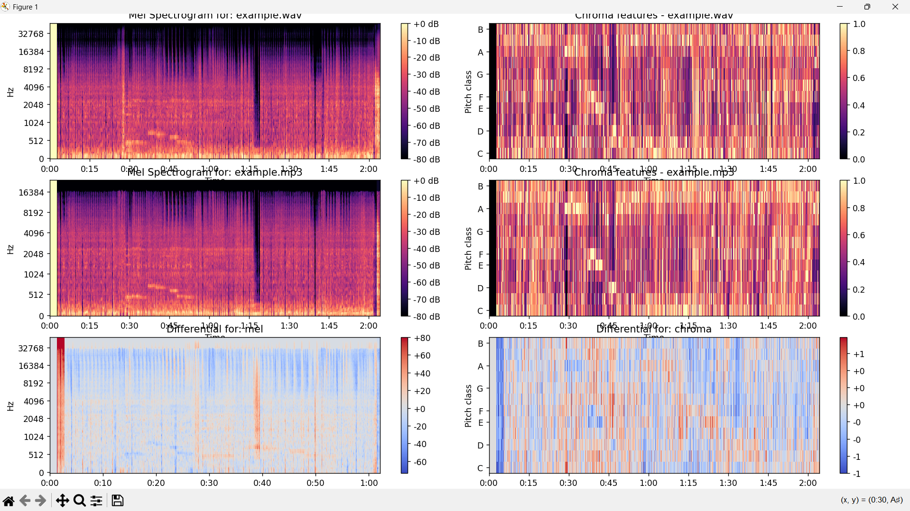

# AI Audio Enhancement Research
## Project Status & Future Roadmap

**A comprehensive overview of our progress in digital audio processing and AI model development**

---

## What Went Well ✅

### 🎵 Deep Understanding of Digital Audio Processing
- Extensive research into **digital audio compression** techniques
- Comprehensive study of **audio quality metrics** and evaluation methods
- Strong foundation in **lossy vs. lossless** audio format differences

### 🤖 AI Model Development Progress
- Successfully initiated the **beginning stages** of our AI model
- Established baseline architecture for audio quality enhancement
- Created foundational framework for future iterations

---

## Challenges Encountered ⚠️

### 📊 Dataset Limitations
- **Lack of diverse datasets** for comprehensive training
- Limited availability of high-quality audio samples
- AI model refinement

### 🔍 Objective Evaluation Metric Issues
- Current evaluation metric **sample rate too low** for our standards
- Performance metrics not meeting expected thresholds
- Self development of evaluation tools

---

## Future Plans & Roadmap 🚀

### 🎯 AI Model Enhancement
- **Continue training** with expanded datasets
- Focus on improving model's ability to **distinguish between lossy and lossless** audio
- Refine neural network architecture for better performance

### 📱 Native Implementation
- **Deploy AI natively** on mobile phones and computers
- Optimize for real-time processing capabilities
- Ensure cross-platform compatibility

### 🌐 Streaming Simulation
- Create **mock environments** to simulate natural streaming conditions
- Test performance under various network conditions
- Validate real-world application scenarios

---

**Key Features:**
- Real-time audio quality visualization
- Comparative analysis between original and enhanced audio
- Intuitive metrics display for end users

---

## Technical Implementation Overview

### 🔧 Backend Architecture
- **VISQoL Integration** for objective audio quality assessment
- Python-based processing pipeline
- Modular design for scalability

### 📊 Analysis Components
- Audio preprocessing and normalization
- Spectrogram generation and analysis
- Quality metrics calculation and comparison

### 🎨 Frontend Visualization
- Interactive audio quality dashboards
- Real-time feedback for users
- Cross-platform web interface

---

## Key Learnings & Technical Insights

### 🎓 Digital Audio Processing Mastery
- Comprehensive understanding of **audio compression algorithms**
- In-depth knowledge of **perceptual audio coding**
- Expertise in **quality assessment methodologies**

### 🔬 Research Methodology
- Systematic approach to AI model development
- Evidence-based evaluation of audio enhancement techniques
- Iterative improvement process for optimal results

---

## Next Steps & Immediate Actions

### Sprint 2
1. **Acquire additional datasets** from diverse sources
2. **Refine AI model architecture** based on current findings
3. **Implement Native pipline for AI** for mock streaming use
